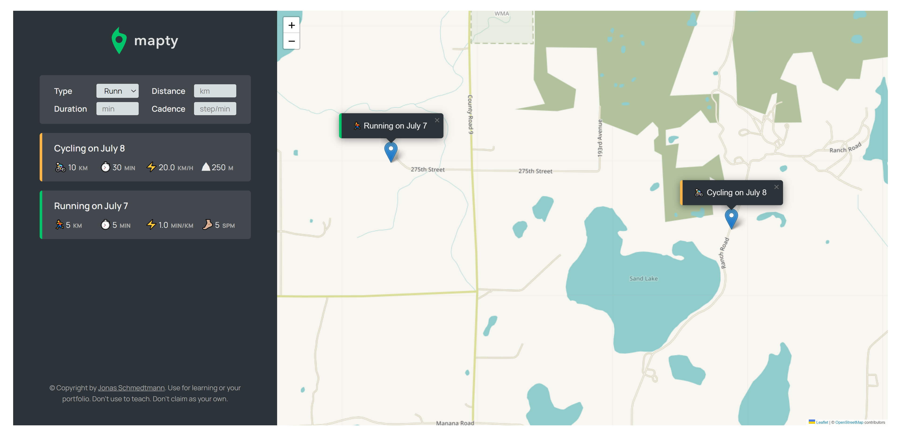

# Mapty

## Link:

Check it out here:

## Description

This is a map application I developed using HTML, CSS, vanilla JavaScript and OOP priciples learned in Jonas Schmedtmann's JavaScript course. All rights belong to Jonas Schmedtmann.
This project helped solidify my understanding of OOP and vanilla JavaScript. For the sake of learning and reviewing, I've left many comments throughout the code.

 

## Screenshots

.png>)

## Functionality

The application can be used to document a user's running or cycling workouts. Upon allowing the application to access the user's location, the user may click anywhere on the map where they initiated their workout. The user is then provided with a form from which they can submit information (using the enter key) regarding their workout, including the workout type (running or cycling), duration, distance, and cadence/elevation gain.
 
 
The user can also click on their past workouts to focus the map on that particular workout. This is useful if the user has several different workouts all over the state or country they would like to view. The application also saves user's workouts, so data persists even upon refreshing the page. The code has been refactored into classes to enhance the code architecture and showcase more modern JavaScript.
 

## Notes

1. The location provided by the map library is not 100% accurate. It may be based on the user's IP address or network. Nevertheless, allowing the application access to your current location will bring the map to somewhere nearby.
2. You can delete your workouts via the console. Implementing this functionality for users has been added to a future improvements list.

## Technology

HTML
 
CSS
 
JavaScript
 
UUID (third-party ID generator) - Used for clicking on previous workouts.
 
Leaflet (third-party library) - Leaflet is used to generate the map and map tiles
 
Local Storage API - Used to store persistent data (user workouts)

## Questions:

Feel free to contact me at mully7773@gmail.com if you have any questions.  
You can view more of my projects at https://github.com/Mully7773.
